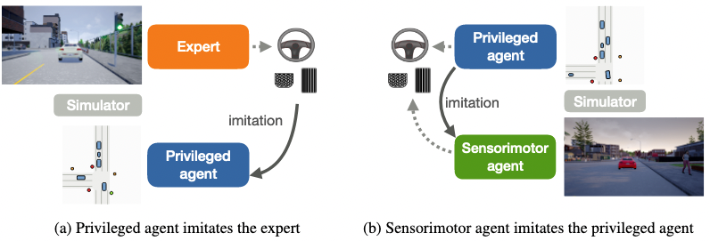

% [Learning by Cheating](http://proceedings.mlr.press/v100/chen20a/chen20a.pdf)

 Dian Chen, Brady Zhou, Vladlen Koltun, Philipp Krahenbuhl

# and [Learning robust perceptive locomotion for quadrupedal robots in the wild](https://leggedrobotics.github.io/rl-perceptiveloco/assets/pdf/wild_anymal.pdf)

Takahiro Miki, Joonho Lee, Jemin Hwangbo, Lorenz Wellhausen, Vladlen Koltun, Marco Hutter

> Figure 1: Overview of our approach. (a) An agent with access to privileged information learns to imitate expert demonstrations. This agent learns a robust policy by cheating. It does not need to learn to see because it gets direct access to the environment’s state. (b) A sensorimotor agent without access to privileged information then learns to imitate the privileged agent. The privileged agent is a “white box” and can provide high-capacity on-policy supervision. The resulting sensorimotor agent does not cheat.

The Learning by Cheating paper improves upon the always-brilliant DAgger [^1] framework, by first training a Behaviour Cloning agent to drive in the CARLA simulator with *priveledged information*, then running online simulated DAgger and using the BC agent to supervise the corrective actions for a final model without access to the priveledged information.

By priveledged information, they mean something like the *full state*, rather than a partial state which has been filtered through an observation function (e.g. a single forward-facing camera image). In particular, they represent the local scene in a top-down bird's eye view, and feed that in to the imitation learner. This is seemingly limited then to simulable environments where we can access the full state, but we'll come back to this point.

After training to convergence, the priveledged agent now supervises the training of a separate imitation learning agent (using the DAgger method) which only receives observations (RGB images) as input. The student network is unrolled online, and at each time step the priveledged agent is queried, and we supervise on the full policy, not just the top action. Apparently the student network can almost completely recover the teacher policy, and now only needs RGB observations to achieve comparable performance!

This is a neat trick, but what does it buy us?

The authors argue that this works because the teacher network only needs to learn how to act, not to perceive, and the student network then only needs to learn how to perceive, because of the strong action supervision by the teacher. Is this really the full story? Unlike language model distillation, there doesn't seem to be a need for policy network scale in the teacher model (although it's just doing simple driving tasks, imitating an expert heuristic controller with full state access), so perhaps it's only shortening the training time? I remember reading a year or two ago about a rather counterintuitive (or at least counter-narrative) study that showed the loss landscape of large language models doing autoregressive generative pre-training was actually quite smooth, not the crazy hilly local-optima-at-every-corner picture people like to throw around. I wonder whether this is the case for reinforcement learning in general as well - its instability would suggest otherwise.

I wonder what extra information the full teacher policy (as opposed to the usual training info of a single ground-truth executed action) contains - didn't Hinton or someone say that the logits of policies used for distillation contain "dark knowledge"? E.g. you can imagine softening an ensemble of classifiers on some labels, and training on the full cateogrical distribution rather than the true class label, and the logit distribution provides a much richer training signal that converges quickly. "Softened outputs reveal the dark knowledge in the ensemble." [^2]

It's interesting to consider what other kinds of "priveledged information" can be used to accelerate training. Another commonly used version of this idea is the "benefit of hindsight", which is the knowledge of the future we can leverage after an episode is completed to better understand the (past's) present, e.g. using heavy offline compute after the fact and temporal consistency constraints to get better labels. The problem with these hindsight approaches is that many of their benefits can't easily be used in the online regime we want to stay in. E.g. even if I know what one potential future is when training a student policy, it may not be relevant for the new environment unroll with the current policy (state divergence too large). It could be interesting to train a teacher policy with access to the future expert state in a learned world model to accelerate policy convergence, then use the teacher policy in a DAgger manner to supervise a student policy...

## Using priveldged learning in the field

The second work I want to discuss is a beauitful application of this privledged teacher training idea to legged robotics control. The method developed in this work was used by team Cerberus to win the DARPA Subterranean Challenge (links!).

Classical optimal control and the open world do not play very nice [^3]. While model predictive control (MPC) style methods have gotten great, we need more than proprioception and perfect self-state models to act confidently and robustly in an open world environment.

One approach we might try is to encode a model of the robot body into a physics simulator, and learn a controller in simulation via reinforcement learning. Because **reinforcement learning can solve any problem**, right? <small>right?</small>

This works fine, and we can definitely learn a robot controller with RL in simulation. The problem is typically that the simulation is never quite good enough, and when we transfer our beautiful RL policy that can run around and bound up stairs to the real robot, it simply falls over, or fatally stumbles immediately. Little discrepencies between the simulated and real dynamics, e.g. a gear slipping, or just physical torque signalling lag compound and bring the policy out of distribution, where it does not know how to recover from.

There are all kinds of tricks employed to overcome sim2real, and a slew of them are used in this work.

The setup is thus:

A teacher policy runs your standard RL (PPO) in a simulated environment, where the reward is accurately following a command velocity. It has full, perfect state access and trains quickly. There is some domain randomization in terms of friction coefficients, force perturbations, etc... as well as a learned actuator module which translates actions to realistic torques (this is meant to model e.g. lag in actuator commands, mechanical errors/uncertainties, etc...).

Next, a student policy is unrolled in the same noisy environment, but is trained solely through imitation learning to match the teacher policy, as well as reconstruct the teacher recurrent state from its belief state. Its observations are noised to make it robust to different real-world sensing failures.

With just that, the student policy can be transferred zero-shot to the real robot and performs outstandingly!

## Outstanding Problems

There are a lot of different components playing together to make this work:

- Learned actuator dynamics
- RL with domain randomization and perturbation
- Curriculum learning to ramp up difficulty at an appropriate rate
- Student-teacher distillation with privleged information
- Recurrent policy which integrates proprioceptive and exteroceptive information over time
- Lots of little reward hacks for the teacher policy to learn smooth motion

So how important is full state here really? It can be really hard to tell which components are necessary in papers like these, with so many moving parts. Let's try to enumerate all the sources of uncertainty and complexity that need to be managed:

| Type      | Example | Solution |
| :-: | :-: | :-: |
| Goal/reward uncertainty      | Dancing       | Imitation or Inverse Reinforcement Learning |
| Compounding error recovery    | Highway driving | On-policy learning |
| Counterfactual planning | Board games | Test-time search with environment model |

priveledged future info, can't have that in online setting, how can the teacher know what future to be privledged with respect to? is it enough to just give it one future

[^1]: [A Reduction of Imitation Learning and Structured Prediction to No-Regret Online Learning](https://www.cs.cmu.edu/~sross1/publications/Ross-AIStats11-NoRegret.pdf)

[^2]: [Dark knowledge: Hinton et al.](https://www.ttic.edu/dl/dark14.pdf)

[^3]: Citation needed
