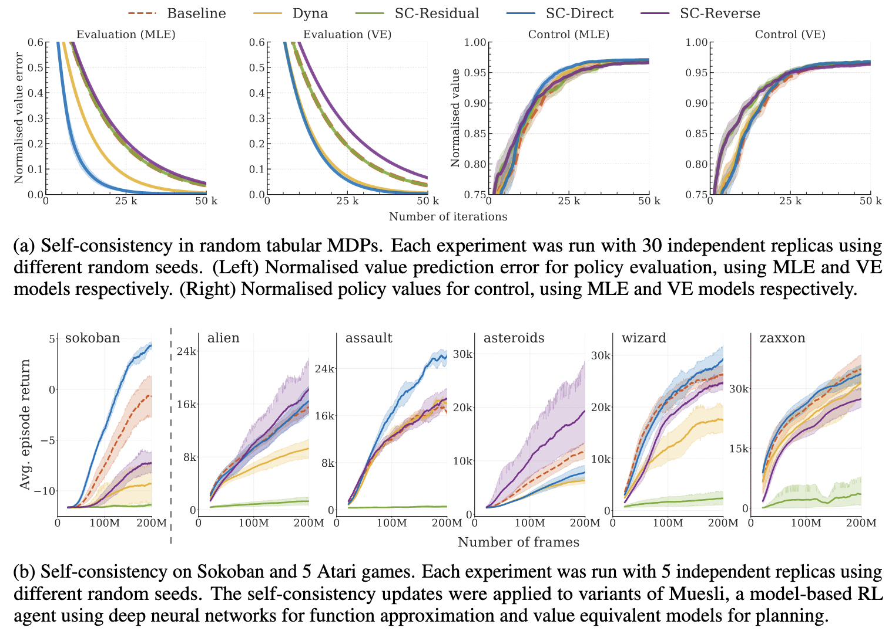

% [Self-Consistent Models and Values](https:/A/arxiv.org/abs/2110.12840)

 Gregory Farquhar, Kate Baumli, Zita Marinho, Angelos Filos,  Matteo Hessel, Hado van Hasselt, David Silver 

> Figure 1: Schematic of model and/or value updates for k = 1 of a multi-step model rollout. Model predictions are red; dashed rectangle identifies the TD targets; superscripts denote steps in the model rollout. Real experience is in black and subscripted with time indices. Blocks represent functions; when color-filled they are updated by minimising a TD objective. (a,b) show planning updates that use only trajectories generated from the model: (a) Dyna updates only the value predictions to be consistent with the model; (b) our SC-Direct jointly updates both value and model to be self-consistent. (c) The value loss in the MuZero form of VE learning is a grounded update that is similar in structure to SC, but uses real experience to compute the TD targets. The model unroll must therefore use the same actions that were actually taken in the environment $m^*$. A grounded update like (c) may be combined with updates in imagination like (a) or (b). Best viewed in color.

This paper brings Dreamer-style agent training to the MuZero architecture, and also proposes a self-consistency constraint that takes cues from Dyna, with a slight twist.

Model Based Reinforcement Learning (MBRL) is having something close to an ImageNet moment right now - finally, the models are actually *working*! We've labored under the unspoken assumption that even moderately complex environments are too difficult to learn dynamics (or world-) models for - so we've had to go straight to approximating things like policies, values, return estimates and Q functions. The full environment has felt far out of reach, but with recent advances, particularly DreamerV2, things have started to change. The question is now much more enjoyably, "how can we use these learned models to accelerate agent training and sample efficiency, and bypass the extreme data hunger of RL?"

It's very intuitive that environment modeling has a much richer training signal than RL rewards - instead of some sparse "win" signal every $10^n$ steps, with awful credit-assignment problems, why don't we just *learn the environment dynamics* and let the agent train for $\infty$ time in the learned model? Data hungry RL, meet infinite, cheap, *latent space* learned simulators.

What I'm *not going to do* is claim that learned world models somehow generalize better, with magical properties extrapolating beyond the support of their data. What I would argue, though, is that full dynamics transitions have so much more learning signal than scalar aggregates like return - it's a kind of *blessing of dimensionality*, rather than a curse. From many fewer transition samples, many more aspects of the relationships between parts of the enironment are observed, compared to the same situation with a sparse supervisory signal. E.g. fewer high-dimension samples cover the data manifold better than (approximately) many low-dimension samples.

The dream is simple: learn a world model from very little experience (perhaps even offline?), and then train a task-achieving agent inside the learned model. OK, there are problems: how do we then specify the reward structure for the task we want to solve in the learned model? How do we know when this fails due to the inner-loop RL vs the outer-loop world modeling?

The trick used in this paper takes one step in the direction of the offline world modeling dream: They use TD($\lambda$) gradients flowed through both the value estimator *and* the learned dynamics model in an imagined rollout to enforce self-consistency between the two. Doing so apparently increases final performance on a variety of difficult simulated environments with fixed interaction budgets:

The exact "self consistency" loss is:

$$
\mathcal{L}^{\text{sc-direct}}(\hat{m}, \hat{v}) = \mathbb{E}_{\hat{m},\pi}
\left[
\sum_{k=0}^{K} \left( \perp \left( \hat{r}_{k} + \gamma\hat{v}_{k+1} \right) -\hat{v}_k  \right)^2
\right]
$$

where $\perp$ is the stop gradient operator[^1] [^2]. I still have to wonder if they need to always remain in the so-called "Value Equivalence" regime, where only vale/reward/policy gradients are allowed to adjust the model - could they not just do the same kind of self-consistency loss directly on the states? They state that:

> [...] there is no loss on the latent states $z^k_t$: e.g. these are not required to match $z_{t+k} = h_{\theta}(o_{1:t+k})$

But why? It seems reasonable to assume additional consistency constraints could achieve similar results...

Either way, this is weird! The fact that this possibly works should be unintuitive - we're adjusting the value function *and* the world model, *based on rollouts in the world model*. It feels like having your cake and eating it too. Understanding why this doesn't blow up, where this can be pushed to, and what it enables looks to be a fun research direction!

[^1]: Don't adjust future estimates to match the past, adjust the past to bootstrap the future.

[^2]: They try the reverse direction stop gradient (SC-Reverse in the Figure) and it does not work well, as expected.